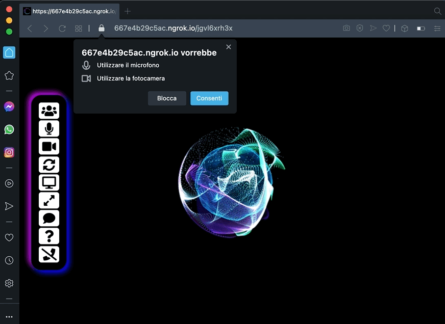

# RYdeo

🚀 `A free WebRTC browser-based video call, chat and screen sharing` 🚀

<br>

[//]: https://img.shields.io/badge/<LABEL>-<MESSAGE>-<COLOR>

[](https://www.linkedin.com/in/miroslav-pejic-976a07101/)

[](https://paypal.me/MiroslavPejic?locale.x=it_IT)
[](https://github.com/miroslavpejic85/mirotalk)
[](https://github.com/prettier/prettier)
[](https://gitter.im/mirotalk/community?utm_source=badge&utm_medium=badge&utm_campaign=pr-badge)

Powered by `WebRTC` using google Stun and [numb](http://numb.viagenie.ca/) Turn. `RYdeo` provides video quality and latency not available with traditional technology.

Open the app in one of following **supported browser**

[//]: #

[](https://rydeo.ropeyou.com/)

## https://rydeo.ropeyou.com/

<br>



## Features

- Is 100% Free and Open Source
- Unlimited users, without time limitation
- Room Url Sharing (share to your friends, wait them to join)
- WebCam Streaming (Front - Rear for mobile)
- Audio Streaming
- Screen Sharing to present documents, slides, and more
- Recording Screen && Audio && Video
- Chat Room && Emoji Picker
- Full Screen Mode on click
- Change Theme
- Select Audio Input - Output && Video source
- Right click on Video elements for more options
- No download required, No account needed, entirely browser based
- Direct peer-to-peer connection ensures lowest latency thanks to webrtc

## Demo

- `Open` https://rydeo.ropeyou.com/newcall
- `Pick` your personal Room name and `Join To Room`
- `Allow` to use the camera and microphone
- `Share` the Room URL and `Wait` someone to join for video conference

## Room name

- You can also `join` dirrectly to your room name by going to https://rydeo.ropeyou.com/join/your-room-name-goes-here

## Quick start

- You will need to have [Node.js](https://nodejs.org/it/) installed, this project has been tested with Node version 12.X
- Clone this repo

```bash
git clone https://github.com/ashokpachauri/rydeo.git
cd rydeo
```

## Setup Turn and Ngrok

- Copy .env.template to .env

```bash
cp .env.template .env
```

`Turn`

- Create an account on http://numb.viagenie.ca
- Get your Account USERNAME and PASSWORD
- Fill in your credentials in the `.env` file
- Set `TURN_ENABLED=true`, if you want enable the Turn Server.

`Ngrok`

- Get started for free https://ngrok.com/
- Fill in your authtoken in the `.env` file
- Set `NGROK_ENABLED=true`, if you want to expose the server using the https tunnel, starting it from your local pc.

## Install dependencies

```js
npm install
```

## Start the server

```js
npm start
```

- Open http://localhost:3000 in browser
- If you want to use a client on another computer/network, make sure you publish your server on an HTTPS connection.
  You can use a service like [ngrok](https://ngrok.com/) Or deploy it on [RYdeo](https://rydeo.ropeyou.com/).
